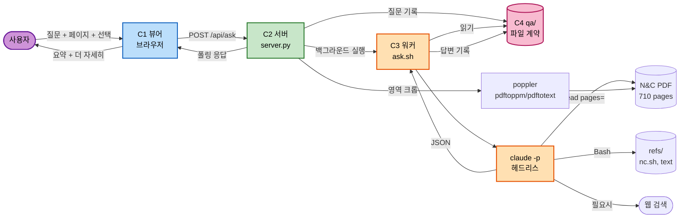

# Component Dependencies & Data Flow

## 의존 행렬

| ↓가 →에 의존 | C1 뷰어 | C2 서버 | C3 워커 | C4 파일 | poppler | claude CLI | KaTeX |
|---|---|---|---|---|---|---|---|
| **C1 뷰어** | — | HTTP | ✗ 없음 | ✗ 없음 | ✗ | ✗ | 로컬 |
| **C2 서버** | ✗ | — | subprocess | 읽기/쓰기 | 실행 | ✗ | ✗ |
| **C3 워커** | ✗ | ✗ | — | 읽기 | 실행(nc.sh 경유) | 실행 | ✗ |
| **C4 파일** | ✗ | ✗ | ✗ | — | ✗ | ✗ | ✗ |

**핵심 성질 — 단방향 의존**:
- 뷰어는 워커의 존재를 모른다. 서버만 안다
- 워커는 뷰어와 서버의 존재를 모른다. 파일만 안다
- C4는 아무것에도 의존하지 않는 순수 데이터

이 덕분에 워커를 통째로 교체해도(예: 나중에 자체 API 에이전트로) 뷰어와 서버는 그대로다.

---

## 통신 패턴

| 경계 | 방식 | 이유 |
|---|---|---|
| 뷰어 ↔ 서버 | HTTP (JSON, PNG) | 브라우저가 쓸 수 있는 유일한 수단 |
| 서버 → 워커 | `subprocess` (한 방향 실행) | 워커는 짧게 살았다 사라진다. 상주 프로세스 없음 |
| 서버 ↔ 워커 | `qa/` 파일 | 프로세스 수명이 달라도 상태가 남는다 (FR-8) |
| 뷰어 → 답변 | HTTP 폴링 | WebSocket을 쓰지 않는다 (NFR-2, 표준 라이브러리) |

**폴링 주기**: 대기 중인 질문이 있을 때만 2초 간격. 없으면 폴링하지 않는다.

---

## 데이터 흐름 — 질문에서 답변까지

### Mermaid



### Text Alternative

```
사용자 -> 뷰어 : 질문 + 현재 페이지 + (선택 문장 또는 영역)
뷰어   -> 서버 : POST /api/ask                       [즉시 반환, 논블로킹]
서버   -> qa/  : questions/<id>.json 기록
서버   -> poppler : 영역이 있으면 크롭 -> crops/<id>.png
서버   -> 워커 : ask.sh <id> summary                 [백그라운드]
워커   -> qa/  : 질문/크롭 읽기
워커   -> claude -p (헤드리스, AI-DLC 규칙 없음)
           |-> Bash    : refs/nc.sh find  (책 원문 검색)
           |-> Read    : PDF 페이지/크롭 이미지 (수식·회로도)
           |-> WebSearch : 필요할 때만
워커   -> qa/  : answers/<id>.json  + history.md
뷰어   -> 서버 : GET /api/answer/<id> 폴링 (2초)
뷰어   -> 사용자 : 요약 표시 + "더 자세히" 버튼
         [클릭 시] -> POST /api/answer/<id>/expand -> 워커 detail 단계 반복
```

---

## 페이지 번호 변환 경계

`pdfPage = bookPage + 34` 변환은 **C2 서버 안에서만** 일어난다.

- C1 뷰어: 책 번호만 다룬다
- C4 파일: 책 번호만 저장한다
- C3 워커: 프롬프트에 변환 규칙을 명시해 스스로 계산한다 (Read 도구가 PDF 페이지 번호를 요구하므로)

변환 지점을 한 곳으로 몰지 않으면 오프셋 버그가 여기저기서 터진다.

---

## 외부 의존성 정리

| 의존 | 용도 | 상태 |
|---|---|---|
| `poppler` (`pdftoppm`, `pdftotext`, `pdfinfo`) | 렌더/텍스트/좌표/크롭 | 설치 확인됨 (`/opt/homebrew/bin`) |
| `claude` CLI | 답변 생성 | 확인됨 (`~/.local/bin/claude`) |
| Python 3.13 표준 라이브러리 | 서버 | `qc_env` venv (NFR-1) |
| KaTeX | 수식 렌더 | 벤더링 예정 ~592KB. **프로젝트 유일의 외부 JS** |

런타임에 네트워크가 필요한 것은 워커의 웹 검색뿐이다. 나머지는 전부 오프라인 동작한다.
