# Execution Plan — N&C 리딩 어시스턴트

## 1. Detailed Analysis Summary

### Change Impact Assessment

| 영역 | 해당 | 내용 |
|---|---|---|
| **User-facing changes** | Yes | 새 도구 전체가 사용자 대면. 뷰어 UI + Q&A 패널 |
| **Structural changes** | Yes (신규) | 3계층 신설: 브라우저 / 미니 서버 / 답변 워커. 파일시스템이 유일한 계층 간 접점 |
| **Data model changes** | Yes (신규) | 질문 JSON, 답변 마크다운, 읽던 위치 상태, Q&A 히스토리 — 4개 파일 계약 신설 |
| **API changes** | Yes (신규) | 미니 서버의 로컬 HTTP 엔드포인트 신설 |
| **NFR impact** | Yes | NFR-7(규칙 격리)이 워커 실행 방식을 직접 제약. NFR-5(비용 0)가 인증 방식을 제약 |

### Risk Assessment

- **Risk Level**: **Low**
- **Rollback Complexity**: Easy — 로컬 파일 삭제로 완전 원복. 마이그레이션·외부 상태 없음
- **Testing Complexity**: Moderate — 순수 로직은 단순하나 `claude -p` subprocess 통합이 검증 포인트

**식별된 불확실성 2건** (Application Design / Code Generation에서 해소):

1. **워커의 도구 권한.** 스모크 테스트는 도구를 쓰지 않는 프롬프트였다. 실제 워커는
   `Bash`(refs/nc.sh), `Read`(PDF 페이지 이미지), `WebSearch`가 필요하다.
   `--permission-mode dontAsk` 또는 `--allowedTools` 조합이 비대화식에서 실제로 통과하는지
   **코드 생성 전에 실증해야 한다.** 통과하지 못하면 FR-9 파이프라인이 성립하지 않는다.
2. **OTD-1 (PDF 렌더링 방식) 미해결.** `pdftoppm` 서버 렌더 vs `pdf.js` 클라이언트 렌더.
   FR-3(드래그 선택 UX)과 NFR-2(의존성 최소)가 서로 다른 답을 가리킨다.

---

## 2. Workflow Visualization

### Mermaid Diagram

```mermaid
flowchart TD
    Start(["User Request"])

    subgraph INCEPTION["INCEPTION PHASE"]
        WD["Workspace Detection<br/><b>COMPLETED</b>"]
        RE["Reverse Engineering<br/><b>SKIPPED</b>"]
        RA["Requirements Analysis<br/><b>COMPLETED</b>"]
        US["User Stories<br/><b>SKIP</b>"]
        WP["Workflow Planning<br/><b>IN PROGRESS</b>"]
        AD["Application Design<br/><b>EXECUTE</b>"]
        UG["Units Generation<br/><b>SKIP</b>"]
    end

    subgraph CONSTRUCTION["CONSTRUCTION PHASE"]
        FD["Functional Design<br/><b>SKIP</b>"]
        NFRA["NFR Requirements<br/><b>SKIP</b>"]
        NFRD["NFR Design<br/><b>SKIP</b>"]
        ID["Infrastructure Design<br/><b>SKIP</b>"]
        CG["Code Generation<br/>Planning plus Generation<br/><b>EXECUTE</b>"]
        BT["Build and Test<br/><b>EXECUTE</b>"]
    end

    subgraph OPERATIONS["OPERATIONS PHASE"]
        OPS["Operations<br/><b>PLACEHOLDER</b>"]
    end

    Start --> WD
    WD --> RE
    RE --> RA
    RA --> US
    US --> WP
    WP --> AD
    AD --> UG
    UG --> FD
    FD --> NFRA
    NFRA --> NFRD
    NFRD --> ID
    ID --> CG
    CG --> BT
    BT --> OPS
    OPS --> End(["Complete"])

    style WD fill:#4CAF50,stroke:#1B5E20,stroke-width:3px,color:#fff
    style RA fill:#4CAF50,stroke:#1B5E20,stroke-width:3px,color:#fff
    style WP fill:#4CAF50,stroke:#1B5E20,stroke-width:3px,color:#fff
    style CG fill:#4CAF50,stroke:#1B5E20,stroke-width:3px,color:#fff
    style BT fill:#4CAF50,stroke:#1B5E20,stroke-width:3px,color:#fff
    style AD fill:#FFA726,stroke:#E65100,stroke-width:3px,stroke-dasharray: 5 5,color:#000
    style RE fill:#BDBDBD,stroke:#424242,stroke-width:2px,stroke-dasharray: 5 5,color:#000
    style US fill:#BDBDBD,stroke:#424242,stroke-width:2px,stroke-dasharray: 5 5,color:#000
    style UG fill:#BDBDBD,stroke:#424242,stroke-width:2px,stroke-dasharray: 5 5,color:#000
    style FD fill:#BDBDBD,stroke:#424242,stroke-width:2px,stroke-dasharray: 5 5,color:#000
    style NFRA fill:#BDBDBD,stroke:#424242,stroke-width:2px,stroke-dasharray: 5 5,color:#000
    style NFRD fill:#BDBDBD,stroke:#424242,stroke-width:2px,stroke-dasharray: 5 5,color:#000
    style ID fill:#BDBDBD,stroke:#424242,stroke-width:2px,stroke-dasharray: 5 5,color:#000
    style OPS fill:#BDBDBD,stroke:#424242,stroke-width:2px,stroke-dasharray: 5 5,color:#000
    style INCEPTION fill:#BBDEFB,stroke:#1565C0,stroke-width:3px,color:#000
    style CONSTRUCTION fill:#C8E6C9,stroke:#2E7D32,stroke-width:3px,color:#000
    style OPERATIONS fill:#FFF59D,stroke:#F57F17,stroke-width:3px,color:#000
    style Start fill:#CE93D8,stroke:#6A1B9A,stroke-width:3px,color:#000
    style End fill:#CE93D8,stroke:#6A1B9A,stroke-width:3px,color:#000

    linkStyle default stroke:#333,stroke-width:2px
```



### Text Alternative

```
INCEPTION PHASE
  Workspace Detection ........ COMPLETED
  Reverse Engineering ........ SKIPPED   (greenfield)
  Requirements Analysis ...... COMPLETED (approved)
  User Stories ............... SKIP
  Workflow Planning .......... IN PROGRESS
  Application Design ......... EXECUTE
  Units Generation ........... SKIP

CONSTRUCTION PHASE
  Functional Design .......... SKIP
  NFR Requirements ........... SKIP
  NFR Design ................. SKIP
  Infrastructure Design ...... SKIP
  Code Generation ............ EXECUTE
  Build and Test ............. EXECUTE

OPERATIONS PHASE
  Operations ................. PLACEHOLDER
```

---

## 3. Phases to Execute

### INCEPTION PHASE

- [x] **Workspace Detection** — COMPLETED
- [x] **Reverse Engineering** — SKIPPED
  - *Rationale*: Greenfield. 소스 코드가 없어 분석 대상이 존재하지 않음
- [x] **Requirements Analysis** — COMPLETED (승인됨)
  - *Rationale*: 2라운드 명확화로 답변 엔진 모순 해소, OTD-3 확정, NFR-7 추가
- [ ] **User Stories** — **SKIP**
  - *Rationale*: 단일 사용자·단일 페르소나 개인 학습 도구. 이해관계자 협업 없음.
    수용 기준이 FR-1~FR-9에 이미 검증 가능한 형태로 기술됨. 스토리가 추가할 정보가 없음
- [x] **Workflow Planning** — IN PROGRESS
- [ ] **Application Design** — **EXECUTE**
  - *Rationale*: 신규 컴포넌트 3개(뷰어 / 미니 서버 / 답변 워커)의 책임 경계와
    파일 기반 큐 프로토콜(4개 파일 계약)을 확정해야 함.
    **미해결 OTD-1(PDF 렌더링 방식)을 여기서 결정한다.**
    또한 위험요소 1(워커 도구 권한)을 여기서 실증한다
- [ ] **Units Generation** — **SKIP**
  - *Rationale*: 3개 컴포넌트가 하나의 파일 프로토콜로 강하게 결합되어 있고 규모가 작다.
    분해해서 병렬 진행할 이득보다 per-unit 루프의 절차 비용이 크다. NFR-2(YAGNI)와 정합

### CONSTRUCTION PHASE

- [ ] **Functional Design** — **SKIP**
  - *Rationale*: 복잡한 비즈니스 로직이 없다. 실질적 "설계 대상"인 파일 프로토콜과 데이터 계약은
    Application Design이 흡수한다. 중복 산출물이 됨
- [ ] **NFR Requirements** — **SKIP**
  - *Rationale*: NFR-1~NFR-7이 requirements.md에 이미 확정. 기술 스택도 결정됨
    (Python 3.13 표준 라이브러리 @ qc_env venv, 바닐라 JS, poppler). 평가할 잔여 항목 없음
- [ ] **NFR Design** — **SKIP**
  - *Rationale*: NFR Requirements를 건너뛰었으므로 종속적으로 불필요.
    단 NFR-7(규칙 격리)의 구현 방식은 Application Design에서 다룬다
- [ ] **Infrastructure Design** — **SKIP**
  - *Rationale*: 클라우드 리소스 없음, 배포 없음, localhost 전용. 매핑할 인프라가 존재하지 않음
- [ ] **Code Generation** — **EXECUTE** (ALWAYS)
  - *Rationale*: 실제 구현. Part 1 계획 → 승인 → Part 2 생성
- [ ] **Build and Test** — **EXECUTE** (ALWAYS)
  - *Rationale*: 실행·검증 절차 필요. 특히 `claude -p` 통합은 실제 질문으로 end-to-end 확인해야 함

### OPERATIONS PHASE

- [ ] **Operations** — PLACEHOLDER

---

## 4. Extension Compliance Summary

| Extension | Enabled | 이 단계 적용 여부 |
|---|---|---|
| Security Baseline | No | N/A — 사용자가 opt-out (requirements.md §5) |
| Resiliency Baseline | No | N/A — 사용자가 opt-out |
| Property-Based Testing | No | N/A — 사용자가 opt-out |

세 확장 모두 비활성이므로 차단성 제약이 적용되지 않는다.

---

## 5. Estimated Timeline

- **실행할 스테이지**: 3개 (Application Design → Code Generation → Build and Test)
- **건너뛸 스테이지**: 6개
- **예상 소요**: Application Design 1 라운드, Code Generation 2 파트(계획+생성), Build and Test 1 라운드.
  각 스테이지마다 승인 게이트가 있음

---

## 6. Success Criteria

**Primary Goal**: 브라우저에서 N&C를 읽다가 우측 패널에 질문하면, Claude Code가 책 원문과
(필요시) 웹을 근거로 답변을 돌려주고, 그 과정에서 AI-DLC 규칙은 개입하지 않는다.

**Key Deliverables**
1. 뷰어 HTML — 좌측 본문(FR-1) + 추출 텍스트 토글(FR-2) + 선택 캡처(FR-3)
2. 로컬 미니 서버 — 정적 제공, 페이지 이미지/텍스트 제공, 질문 접수, 답변 조회, 위치 저장
3. 답변 워커 — `claude -p` 호출 래퍼. AI-DLC 트리 바깥에서 실행, `--add-dir`로 refs 접근
4. 실행 방법 문서

**Quality Gates**
- [ ] QG-1 — 워커가 `Bash`/`Read`/`WebSearch`를 비대화식으로 실제 사용 가능함을 실증 (위험요소 1)
- [ ] QG-2 — 워커 실행 시 AI-DLC `CLAUDE.md`가 로드되지 않음을 토큰 수로 확인 (NFR-7, 기준 13,410 근방)
- [ ] QG-3 — 책 페이지 번호 표시가 실제 지면과 일치 (오프셋 +34 검증)
- [ ] QG-4 — 수식·양자회로도가 포함된 페이지가 손실 없이 표시됨 (FR-1)
- [ ] QG-5 — end-to-end: 실제 질문 1건이 답변까지 도달, 근거 페이지 번호 포함 (FR-5)
- [ ] QG-6 — 브라우저 재시작 후 마지막 페이지에서 재개 (FR-7)
- [ ] QG-7 — 질문당 API 과금 없음 (NFR-5)
